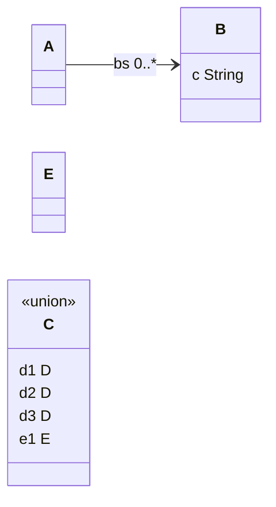

## Example
<!--tmpl,code=mermaid:deno run --quiet --unstable --allow-all ./gen-adl-docs.ts example -->

```mermaid
classDiagram
    direction LR;

    class example_A["A"]
    class example_B["B"]
    class example_E["E"]
    class example_C["C"]
    <<union>> example_C

    example_A --> example_B : bs 0..*️

    example_B : c String
    example_C : d1 D
    example_C : d2 D
    example_C : d3 D
    example_C : e1 E

```
<!--/tmpl-->

